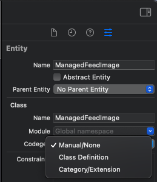

# CoreData

## Setting up CoreData

1. Add new `Data Model` aka `.xcdatamodeld`.
2. Click "Add Entity" for your entities (e.g. `ManagedGroup` and `ManagedItem`).
3. Add your attributes and relationships. This example uses a one-to-many relationship with an ordered set for `ManagedGroup` to `ManagedItem` and a one-to-one relationship for `ManagedItem` to `ManagedGroup`.
4. Make non-optional attributes on RHS (not Swift Optional)
5. Build / Clean / Restart Xcode

## Checklist

* Set relationship directions
* cascading deletes (top down, but not bottom up)

### Setting up custom `NSManagedObject` classes

On the RHS for any entry, mark `codegen` as `manual/none`. Now create your own `NSManagedObject classes for each entity. See [Example](#example) below.



### Resetting CoreData context if there are issues

To reset the core data MOC, use `context.rollback()` within a catch block. Remember, Core data works on a snapshot system. Besides for when you add a new entity instance to a context, any update or deletion will only persist if there you use `try context.save()` and that is successful.

## Setting `NSFetchRequest.returnsObjectsAsFaults = false`

By default `returnObjectsAsFaults` is true, so Core Data fetches the object data for the matching records, fills the row cache with the information, and returns managed objects as faults. When a fault is fired, Core Data retrieves the data from the row cache.

While the overhead is small, if you are iterating over a ton of data (e.g. caclulating the aveerage value of a property/attribute), then it is efficient to set `returnObjectsAsFaults = false`.

## Useful Extensions

NOTE: These extensions allow you to specify where to load CoreData into a private `context` with a custom `url`. You can also simply create a persistent container like shown below. Holding Core data in a `private context` with its own `private queue` and doing processing there is a better experience for your users.

``` swift
let persistentContainer: NSPersistentContainer = {
    let container = NSPersistentcontainer(name: "ItemStore")
    var loadError: Swift.Error?
    container.loadPersistentStores { loadError = $1 }
    try loadError.map { fatalError("Loading of store failed \(error)") }

    return container
}()
```

### Simplifying Container Creation

`load` creates a description of where you want to load the store (i.e. `url`). Then `load` creates the conatiner for the MOM and adds the description to it. Once the persistent container has been initialized, you need to execute `loadPersistentStores(completionHandler:)` to instruct the container to load the persistent stores and complete the creation of the Core Data stack. Once the completion handler has fired, the stack is fully initialized and is ready for use. The error is captured and thrown if it exists.

```swift
extension NSPersistentContainer {
	static func load(name: String, model: NSManagedObjectModel, url: URL) throws -> NSPersistentContainer {
        // create the store description, specifying where to store the 
		let description = NSPersistentStoreDescription(url: url)
		let container = NSPersistentContainer(name: name, managedObjectModel: model)
		container.persistentStoreDescriptions = [description]

		var loadError: Swift.Error?
		container.loadPersistentStores { loadError = $1 }
		try loadError.map { throw $0 }

		return container
	}
}
```

### Creating a extension NSManagedObjectModel programmatically

> NOTE: There should be a .xcdatamodeld equivalent of the class that is bundled (e.g. CoreDataItemStore.xcdatamodeld). This allows CoreData to prepare the database properly.

```swift
extension NSManagedObjectModel {
    // e.g.: NSManagedObjectModel(name: modelName, in: Bundle(for: CoreDataItemStore.self))
	convenience init?(name: String, in bundle: Bundle) {
		guard let momd = bundle.url(forResource: name, withExtension: "momd") else {
			return nil
		}
		self.init(contentsOf: momd)
	}
}
```

## Example

```swift
import CoreData

public final class CoreDataItemStore {

    private static let modelName = "ItemStore"
    private static let model = NSManagedObjectModel(name: modelName, in: Bundle(for: CoreDataItemStore.self))

    /*
    Alternative: insert a new object as an entity description
    let item = NSEntityDescription.insertNewObject(forEntityName: "Item", into: context) as Item
    */

    private let container: NSPersistentContainer
    private let context: NSManagedObjectContext

    // inject storeURL
    public init(storeURL: URL) throws {
        guard let model = CoreDataItemStore.model else {
			throw ModelNotFound(modelName: CoreDataItemStore.modelName)
		}

        container = try NSPersistentContainer.load(
			name: CoreDataItemStore.modelName,
			model: model,
			url: storeURL
		)

        // instead of persistentContainer.viewContext, which is associated with the main queue instead of this privately managed one
		context = container.newBackgroundContext() 
    }

    public func retrieve(completion: @escaping RetrievalCompletion) {
		let context = self.context
		context.perform {
			do {
				if let data = try ManagedGroup.find(in: context) {
					completion(.found(feed: data.local, timestamp: data.timestamp))
				} else {
					completion(.empty)
				}
			} catch {
				completion(.failure(error))
			}
		}
	}

    public func insert(_ feed: [LocalItem], timestamp: Date, completion: @escaping InsertionCompletion) {
		let context = self.context
		context.perform {
			do {
				try ManagedGroup.replaceCurrentFeedIfPresent(with: feed, at: timestamp, in: context)
				try context.save()
				completion(nil)
			} catch {
                // it is important to rollback the changes if failed to delete or save. Don't just throw a fatal error/do nothing
				context.rollback()
				completion(error)
			}
		}
	}

    public func delete(completion: @escaping (Error?) -> Void) {
        let context = self.context
		context.perform {
			do {
				try ManagedItem.delete(in: context)
				try context.save()
				completion(nil)
			} catch {
                // it is important to rollback the changes if failed to delete or save. Don't just throw a fatal error/do nothing
				context.rollback()
				completion(error)
			}
		}
    }
}

@objc(ManagedItem)
final class ManagedItem: NSManagedObject {
	@NSManaged var id: UUID
	@NSManaged var optionalProperty: String?
	@NSManaged var url: URL
	@NSManaged var items: ManagedItem
}

@objc(ManagedGroup)
final class ManagedGroup: NSManagedObject {
	@NSManaged var timestamp: Date
	@NSManaged var feed: NSOrderedSet

	static func find(in context: NSManagedObjectContext) throws -> ManagedGroup? {
		let request = NSFetchRequest<ManagedGroup>(entityName: entity().name!)
		request.returnsObjectsAsFaults = false 
		return try context.fetch(request).first // returns only first object out of all matching
	}

	static func delete(in context: NSManagedObjectContext) throws {
		try ManagedGroup.find(in: context).map(context.delete)
	}

	private static func map(_ local: [LocalItem], in context: NSManagedObjectContext) -> NSOrderedSet {
		return NSOrderedSet(array: local.map { local in
			let managed = ManagedItem(context: context)
			/* Map out your items here */
			return managed
		})
	}
}

```

## Links

* [Modeling Data with CoreData](https://developer.apple.com/documentation/coredata/modeling_data?language=objc)
* [Parsing JSON in private background thread](https://developer.apple.com/library/archive/documentation/Cocoa/Conceptual/CoreData/Concurrency.html#//apple_ref/doc/uid/TP40001075-CH24-SW1)